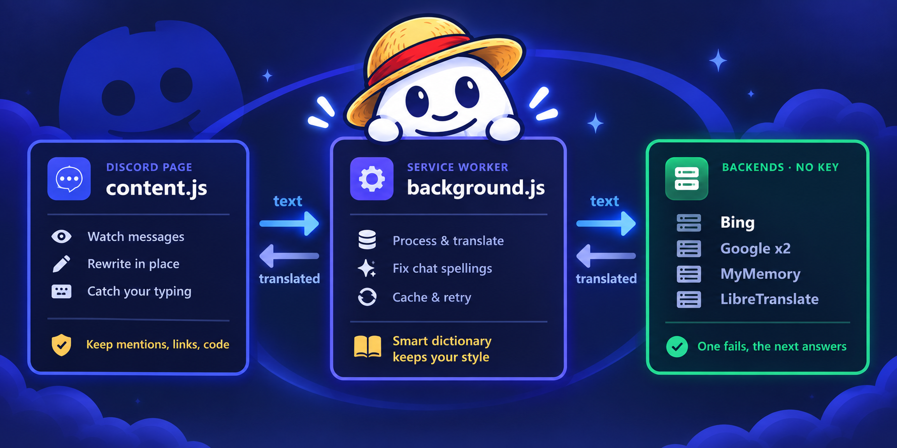

<div align="center">


# Translator for Discord

**Read every Discord message in your own language. Send yours in theirs.**


</div>

---

| | |
|---|---|
| **Setup** | None. No account, no API key |
| **Translator** | Bing, with silent fallbacks. No key, no account |
| **Languages** | 45 to read and write, 17 typeable in Latin letters |
| **Scope** | All of Discord, one server, or one channel |
| **Untouched** | Bot commands, links, mentions, emoji, code |

---

## What it does

Messages are rewritten where they sit. Nothing moves.

```diff
- welcome to the server, glad you made it
+ সার্ভারে স্বাগতম, খুশি হলাম তুমি এসেছো
```

And the other way round. Enter always sends exactly what you typed; the
translate button in the message box is what translates:

```diff
- vai dam koto ekhon
+ Brother, how much is the price now?
```

That second one is Bengali typed on an English keyboard. Hindi, Arabic and
fifteen others work the same way.

| Also | |
|---|---|
| Any source language | Detected per message, or pin it to one |
| Internet words | *fomo*, *chill*, *skibidi* stay as they are |
| Shorthand | `brb`, `gtg`, `ttyl` translate to what they mean |
| Bot commands | `/ban`, `!verify` go through byte for byte |
| Links, mentions, code | Never touched |
| Names | Never translated |

---

## Install

```
1.  Code → Download ZIP, unzip somewhere permanent
2.  chrome://extensions  →  Developer mode  →  Load unpacked
3.  Open Discord, click the icon, pick a language
```

Chrome · Edge · Brave · Opera. Firefox needs
[one line changed](ARCHITECTURE.md).

---

## Settings

Six, and that is the lot.

| | |
|---|---|
| **On / off** | Or `Alt+T` |
| **Reading** | Translate everything, or only the message you point at |
| **From → Into** | Detect each message, or pin the language the server speaks |
| **Send as** | What the translate button in the message box sends in |
| **Where it runs** | Everywhere, one server, or one channel |

Nothing else is a setting, because nothing else has a second right answer.
Internet words are always kept, the polite written register is always relaxed,
embeds are always included, a message already in your language is always left
alone, and text typed in Latin letters is put back into its own script when
that is what it turns out to be.

## Languages

⌨️ marks the ones you can type in English letters.

| | | |
|---|---|---|
| 🇧🇩 **Bengali** বাংলা ⌨️ | 🇬🇧 **English** | 🇮🇳 **Hindi** हिन्दी ⌨️ |
| 🇵🇰 **Urdu** اردو ⌨️ | 🇸🇦 **Arabic** العربية ⌨️ | 🇪🇸 **Spanish** Español |
| 🇵🇹 **Portuguese** Português | 🇫🇷 **French** Français | 🇩🇪 **German** Deutsch |
| 🇮🇹 **Italian** Italiano | 🇳🇱 **Dutch** Nederlands | 🇷🇺 **Russian** Русский ⌨️ |
| 🇺🇦 **Ukrainian** Українська | 🇵🇱 **Polish** Polski | 🇹🇷 **Turkish** Türkçe |
| 🇮🇷 **Persian** فارسی ⌨️ | 🇮🇱 **Hebrew** עברית ⌨️ | 🇯🇵 **Japanese** 日本語 |
| 🇰🇷 **Korean** 한국어 | 🇨🇳 **Chinese** 简体中文 | 🇹🇼 **Chinese** 繁體中文 |
| 🇮🇩 **Indonesian** Bahasa Indonesia | 🇲🇾 **Malay** Bahasa Melayu | 🇵🇭 **Filipino** |
| 🇻🇳 **Vietnamese** Tiếng Việt | 🇹🇭 **Thai** ไทย | 🇲🇲 **Burmese** မြန်မာ |
| 🇳🇵 **Nepali** नेपाली ⌨️ | 🇱🇰 **Sinhala** සිංහල ⌨️ | 🇮🇳 **Tamil** தமிழ் ⌨️ |
| 🇮🇳 **Telugu** తెలుగు ⌨️ | 🇮🇳 **Malayalam** മലയാളം ⌨️ | 🇮🇳 **Kannada** ಕನ್ನಡ ⌨️ |
| 🇮🇳 **Marathi** मराठी ⌨️ | 🇮🇳 **Gujarati** ગુજરાતી ⌨️ | 🇮🇳 **Punjabi** ਪੰਜਾਬੀ ⌨️ |
| 🇰🇪 **Swahili** Kiswahili | 🇸🇪 **Swedish** Svenska | 🇳🇴 **Norwegian** Norsk |
| 🇩🇰 **Danish** Dansk | 🇫🇮 **Finnish** Suomi | 🇨🇿 **Czech** Čeština |
| 🇷🇴 **Romanian** Română | 🇭🇺 **Hungarian** Magyar | 🇬🇷 **Greek** Ελληνικά ⌨️ |

---

## How it works

<div align="center">



</div>

One translator, no key, nothing to sign up for. Bing is the only keyless
service that reads casual writing the way a person does — Google and MyMemory
render word for word, DeepL has no Bengali and rate-limits without a key, and
every public LibreTranslate instance is now gone or key-gated. The others stay
in the chain so that a Bing outage is not an outage here, but there is nothing
to choose.

Internals in **[ARCHITECTURE.md](ARCHITECTURE.md)** — pipeline order, dictionary
format, how React is survived, known limits.

---

## Privacy

Message text goes to the backend you chose and nowhere else. No cookies, no
account, no logging, no analytics. Settings stay in your browser.

Keep it off the network entirely:

```bash
docker run -p 5000:5000 libretranslate/libretranslate
```

---

## Development

```bash
npm run serve                                              # mock Discord page
chrome --headless=new --remote-debugging-port=9222 about:blank
npm test                                                   # 8 DOM checks
npm run build:dictionary                                   # rebuild the filter
```

| Add | Where |
|---|---|
| A language | `DT_LANGUAGES` in `src/common.js` |
| A word that stays untranslated | `DT_KEEP_WORDS` in `src/slang.js` |
| A chat spelling | `DT_RESPELL` in `src/slang.js` |
| Tone rules | `DT_TONE` in `src/tone.js` |
| A backend | `PROVIDERS` in `src/background.js` |

Issues and pull requests welcome.

---

## License

MIT — see [LICENSE](LICENSE).

<div align="right"><sub>built by <b>mosfick</b></sub></div>
