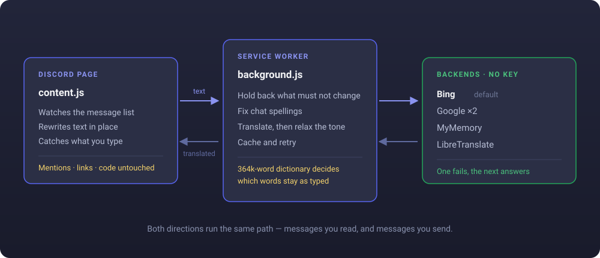

<div align="center">


# Translator for Discord

**Read every Discord message in your own language. Send yours in theirs.**
Real-time, in place, in 45 languages — with no account and no API key.


</div>

---

## What it does

Messages are translated **where they sit**. Nothing moves, nothing is added —
the words simply arrive in your language, in the same place, in the same order.

It works the other way round too. Type in your own language, press Enter, and
the message goes out translated.

```
  they write  →  gm frens, wen mint?    you read  →  gm frens, কখন mint?
  you type    →  vai dam koto ekhon     they read →  Brother, how much is the price now?
```

Free, open source, and nothing to set up: no account, no sign-up, no API key.

---

## Install

1. **Code → Download ZIP**, then unzip it somewhere you will not delete —
   Chrome loads the extension from that folder every time it starts.
2. Open `chrome://extensions`.
3. Turn on **Developer mode**, top right.
4. Click **Load unpacked** and choose the folder.
5. Open Discord, click the extension icon, pick your language.

Chrome · Edge · Brave · Opera · any Chromium browser.
Firefox needs one line changed — see [Development](#development).

---

## How it works

In plain terms, four things happen:

1. **It watches the channel.** Every message already on screen, and every one
   that arrives afterwards, is noticed straight away.
2. **The words are sent to a translation service** — just the words. Links,
   mentions, emoji and code are held back.
3. **The translation replaces the original text in place.** The message does not
   move, and everything held back is put straight back where it was.
4. **When you type, the same happens in reverse** before the message is sent.

<div align="center">



</div>


Five services, no keys. If one fails, the next answers.

| | | |
|---|---|---|
| **Bing** | *default* | Reads casual writing the way a person does |
| **Google** | | Fastest, but word for word. Two endpoints, separate limits |
| **MyMemory** | | Open API, roughly 5,000 words a day |
| **LibreTranslate** | | Fully open source, on a server you run yourself |

---

## Languages

45 languages to read and write. ⌨️ marks the ones you can also **type in English
letters** — Banglish, Hinglish, Arabizi and the rest.

| | | |
|---|---|---|
| 🇧🇩 **Bengali** বাংলা ⌨️ | 🇬🇧 **English** | 🇮🇳 **Hindi** हिन्दी ⌨️ |
| 🇵🇰 **Urdu** اردو ⌨️ | 🇸🇦 **Arabic** العربية ⌨️ | 🇪🇸 **Spanish** Español |
| 🇵🇹 **Portuguese** Português | 🇫🇷 **French** Français | 🇩🇪 **German** Deutsch |
| 🇮🇹 **Italian** Italiano | 🇳🇱 **Dutch** Nederlands | 🇷🇺 **Russian** Русский ⌨️ |
| 🇺🇦 **Ukrainian** Українська | 🇵🇱 **Polish** Polski | 🇹🇷 **Turkish** Türkçe |
| 🇮🇷 **Persian** فارسی ⌨️ | 🇮🇱 **Hebrew** עברית ⌨️ | 🇯🇵 **Japanese** 日本語 |
| 🇰🇷 **Korean** 한국어 | 🇨🇳 **Chinese** 简体中文 | 🇹🇼 **Chinese** 繁體中文 |
| 🇮🇩 **Indonesian** Bahasa Indonesia | 🇲🇾 **Malay** Bahasa Melayu | 🇵🇭 **Filipino** |
| 🇻🇳 **Vietnamese** Tiếng Việt | 🇹🇭 **Thai** ไทย | 🇲🇲 **Burmese** မြန်မာ |
| 🇳🇵 **Nepali** नेपाली ⌨️ | 🇱🇰 **Sinhala** සිංහල ⌨️ | 🇮🇳 **Tamil** தமிழ் ⌨️ |
| 🇮🇳 **Telugu** తెలుగు ⌨️ | 🇮🇳 **Malayalam** മലയാളം ⌨️ | 🇮🇳 **Kannada** ಕನ್ನಡ ⌨️ |
| 🇮🇳 **Marathi** मराठी ⌨️ | 🇮🇳 **Gujarati** ગુજરાતી ⌨️ | 🇮🇳 **Punjabi** ਪੰਜਾਬੀ ⌨️ |
| 🇰🇪 **Swahili** Kiswahili | 🇸🇪 **Swedish** Svenska | 🇳🇴 **Norwegian** Norsk |
| 🇩🇰 **Danish** Dansk | 🇫🇮 **Finnish** Suomi | 🇨🇿 **Czech** Čeština |
| 🇷🇴 **Romanian** Română | 🇭🇺 **Hungarian** Magyar | 🇬🇷 **Greek** Ελληνικά ⌨️ |

---

## Using it

Everything is in the popup. Changes apply the moment you make them — no save
button, no reloading Discord.

### Reading

Set **Translate everything into** and you are done. Four switches shape it:

| Switch | What it does |
|---|---|
| **Skip if already in that language** | Leaves messages you can already read |
| **Translate embeds too** | Bot embeds and link previews as well as messages |
| **Keep internet words as they are** | *fomo*, *chill*, *wagmi*, *mint* stay in English |
| **Everyday wording** | Relaxes the stiff written form into how people actually type |

Hold **Alt** and click a message to see what was originally written.
**Alt+T** turns everything off and on.

### Writing

Turn on **Translate what I type before sending**, choose the language to send
in, then pick what Enter does:

| | |
|---|---|
| **Translate and send it** | Type, press Enter, the translated message goes out |
| **Translate, let me check it first** | Fills the box and waits for a second Enter |

Start with the second one until you trust it.

Bot commands are never touched, so `/ban`, `!verify` and `?help` still work.

### Typing in English letters

If you write your language on an English keyboard, turn on **I type my language
in English letters** and say which language it really is.

Without it, translators guess wrong — `vai dam koto ekhon` gets read as
Vietnamese. With it, the text is put back into its own script first, so the
language is no longer a guess. English words inside the sentence stay English,
because that is how people write.

### Where it runs

Open the popup while you are in the channel you care about and pick one:

| | |
|---|---|
| **All of Discord** | Every server and every DM |
| **This server only** | The server open when you chose it |
| **This channel only** | That one channel |

---

## Under the hood

| | |
|---|---|
| **Text nodes, not elements** | Mentions, links and formatting are never visited, so they survive intact |
| **React-proof** | A `MutationObserver` re-applies from cache when Discord re-renders. The marker is a CSS pseudo-element; nothing is injected into Discord's DOM |
| **Whole messages** | A message split by a mention is joined with numbered placeholders and sent as one string, so the translator sees a sentence |
| **Dictionary, not a list** | A Bloom filter over 364k English words in 356 KB. A Latin word it does not know was invented by the internet, so it is held back — *skibidi* and *delulu* work on first sight |
| **Curated where it must be** | Words that *are* English but mean something else here (*chill*, *gas*, *floor*), and greetings a dictionary happens to contain (*gm*, *gn*) |
| **Spellings fixed first** | `wen mint?` becomes *"you mint?"* otherwise. Shorthand for a whole sentence — `brb`, `gtg` — is translated instead of held back |
| **Tone relaxed** | Only where a mechanical change is always right: Bengali, Hindi, Turkish, Indonesian, Malay. Spanish, French and German conjugate the verb to match the pronoun, so they pass through untouched |

---

## Privacy

Message text goes to the translation service you chose and nowhere else. No
cookies, no account, no logging, no analytics. Settings stay in your browser.

For nothing to leave your network at all, run LibreTranslate yourself:

```bash
docker run -p 5000:5000 libretranslate/libretranslate
```

---

## Development

```
manifest.json           MV3 manifest
popup/                  settings panel, Discord's own palette
src/content.js          observes the message list, rewrites text, drives the composer
src/background.js       network, provider chain, cache
src/slang.js            respellings, expansions, words held back
src/dictionary.js       Bloom filter lookup
src/dictionary.bin      364k words in 356 KB
src/tone.js             polite register relaxed into speech
test/                   mock Discord page, DevTools-driven DOM test
tools/                  rebuilds the dictionary
```

```bash
npm run serve                                              # mock Discord page
chrome --headless=new --remote-debugging-port=9222 about:blank
npm test                                                   # 8 DOM checks
npm run build:dictionary                                   # rebuild the filter
```

The test drives a real Chrome over the DevTools protocol against a page that
reproduces Discord's markup, and asserts what changed: messages rewritten in
place, a late message caught by the observer, mentions and links and code
untouched.

**Firefox** — replace the service worker declaration:

```json
"background": { "scripts": ["src/background.js"] }
```

**Extending**

| | |
|---|---|
| A language | `DT_LANGUAGES` in `src/common.js` |
| A word that should stay untranslated | `DT_KEEP_WORDS` in `src/slang.js` |
| A chat spelling | `DT_RESPELL` in `src/slang.js` |
| Tone rules for a language | `DT_TONE` in `src/tone.js` |
| A translation backend | A function returning `{ text, detected }`, in `PROVIDERS` |

Issues and pull requests welcome.

---

## License

MIT — see [LICENSE](LICENSE).

<div align="right"><sub>built by <b>mosfick</b></sub></div>
